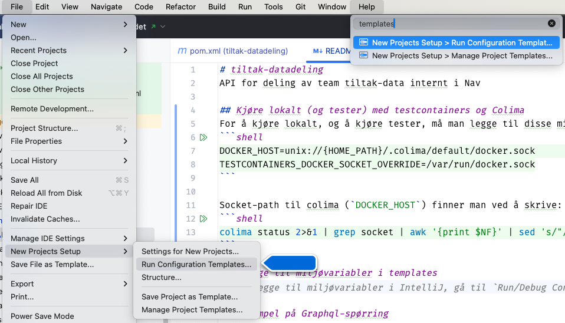

# tiltak-datadeling
API for deling av team tiltak-data internt i Nav

## Be om tilgang

Vi ber om at våre konsumenter leser våre [bruksvilkår](docs/bruksvilkaar.md).

For å be om tilgang, kontakt teamet på kanalen #arbeidsgiver-tiltak.
Vi aksepterer også pull requests hvor nye applikasjoner legges til i appens accessPolicy:
```yaml
  accessPolicy:
    inbound:
      rules:
        # LENKE TIL MIN BEHANDLINGSKATALOG
        - application: <MIN-APP>
          namespace: <MITT-NAMESPACE>
          cluster: <MITT-CLUSTER>
        # Eksempel:
        # https://behandlingskatalog.intern.nav.no/process/system/TILTAKSGJENNOMFORING/780e3168-cf58-46ec-9764-a6cdd3da3b8f
        - application: tiltaksgjennomforing-api
          namespace: arbeidsgiver
          cluster: dev-fss
```

## URL'er
**dev-gcp:** https://tiltak-datadeling.intern.dev.nav.no/graphql (http://tiltak-datadeling.team-tiltak/graphql)<br/>
**prod-gcp:** https://tiltak-datadeling.intern.nav.no/graphql (http://tiltak-datadeling.team-tiltak/graphql)

## Kjøre lokalt (og tester) med testcontainers og Colima
For å kjøre lokalt, og å kjøre tester, må man legge til disse miljøvariablene:
```shell
DOCKER_HOST=unix://{HOME_PATH}/.colima/default/docker.sock
TESTCONTAINERS_DOCKER_SOCKET_OVERRIDE=/var/run/docker.sock
```

Socket-path til colima (`DOCKER_HOST`) finner man ved å skrive:
```shell
colima status 2>&1 | grep socket | awk '{print $NF}' | sed 's/"//'
```

### Legge til miljøvariabler i templates
For å legge til miljøvariabler i IntelliJ, gå til `Run/Debug Configurations` -> `Templates` -> `JUnit`/`Spring Boot`/`Kotlin` -> `Environment variables` og legg til variablene der.


## Eksempel på Graphql-spørring

```graphql
{
  avtalerForBedrift(organisasjonsnummer: "910825526") {
    avtaleId
    avtaleNr
    deltakerFnr
    bedriftNr
    veilederNavIdent
    tiltakstype
  }
}
```
