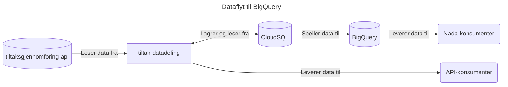

# 02 - Vi lagrer data i Postgres (CloudSQL i GCP)

## Kontekst

For å kunne tilby et api for konsumenter av tiltaksdata må vi hente, transformere og lagre data fra databasen
([ETL](https://en.wikipedia.org/wiki/Extract%2C_transform%2C_load)) til `tiltaksgjennomforing-api`. Konsumenter er ikke
nødvendigvis interessert i all informasjon som ligger i datasettet, og noe informasjon fra databasen kan kreve for mye
domenekunnskap.

Foreløpig indikasjon fra team som ønsker å konsumere data fra oss er i all hovedsak at de ønsker å vite om innbyggere
er på tiltak eller ikke, og hvis ja, type tiltak/antall/varighet.

Minst én konsument har uttrykt et ønske om å ikke benytte et api, men vil heller konsumere data fra **Nada**
(datamarkedsplassen). På bakgrunn av dette vil det være fornuftig å bruke en database som tillater eksponering av data
dit. Derfor blir BigQuery et naturlig valg; da igjennom en dataspeiling fra en Postgres-base (CloudSQL).

## Konsekvenser

Brukere får tilgang til "nåbildet" for tiltak, og kan konsumere data via to kanaler (Nada og maskinelt via api).

### Fordeler

- Vi bruker eksisterende metodikk (Flyway-migrering, konfigurasjon av database via Nais).
- Vi gjenbruker en dataflyt som er kjent på tvers i Nav

### Ulemper

CloudSQL-databasen blir i stor grad "unødvendig infrastruktur". Vi ønsker å tilby data på Nada, og må derfor via
BigQuery da Nada i stor grad er basert på dette. Vi kunne lagret data direkte til BigQuery, men opplever at teamets
"verktøykasse" ikke har god støtte for dette. 

## Alternativer

## OpenSearch

Ettersom datadeling er en ETL som kun skal brukes til å gjøre oppslag i data, kan OpenSearch være en god
lagringsbackend, som vil levere data på en søkeoptimalisert måte.

Dessverre vil ikke OpenSearch hjelpe oss med å få data ut i BigQuery, som blokkerer levering av data på Nada.

## Bruke BigQuery direkte

Dersom et av våre mål er å lagre data i BigQuery, kan det være ønskelig å lagre data direkte uten å gå via CloudSQL.
Men dette vil kanskje føre til friksjon i utviklingen, relatert til lokal testing og SQL-migreringer.
